# containment-cut

**Everyone will tell you your blast radius. Nobody tells you the minimum cut to stop it.**

Attack-path tools map the damage: *from this account, the attacker can reach these 40
things.* Useful — once. Then you are standing in a war room at 3am with a graph, a
business that still has to run, and one question nobody's tool answers:

> **What is the smallest, cheapest set of things I can switch off, right now, that
> provably severs this attacker from the crown jewels?**

`containment-cut` computes exactly that. It takes a tenant graph, a compromised identity
and your crown jewels, and returns the **minimum-cost set of containment actions** that
disconnects one from the other — with the exact Microsoft Graph / Azure CLI call for each
step, in dry-run, and a machine-checkable proof that no cheaper plan exists.

It is the inverse of a blast radius. A blast radius is a reachability query. This is an
optimisation problem, and it has a right answer.

> Piece 3 of the Active Defense Trilogy — **detect** ([entra-tripwire](https://github.com/earbona23/entra-tripwire)) →
> **analyse** ([revtriage](https://github.com/earbona23/revtriage)) → **contain** (this).

---

## 30 seconds

```bash
git clone https://github.com/earbona23/containment-cut && cd containment-cut
pip install -e .            # no runtime dependencies
containment-cut demo
```

*(Not on PyPI yet. `pip install git+https://github.com/earbona23/containment-cut` also
works.)*

The bundled tenant is synthetic: a phished payroll analyst and a client secret an attacker
added to the travel-booking app. Four independent routes reach Global Administrator and
the production payments Key Vault.

```
$ containment-cut demo

containment-cut  ·  DRY RUN. Nothing was changed.
tenant: contoso-demo.onmicrosoft.com (SYNTHETIC — no real tenant, no real people)

Compromised: Ana Reyes (payroll analyst), TravelBot client secret #2 (added by the attacker)
Crown jewels: Global Administrator, Key Vault: kv-prod-payments
Exposed now: Global Administrator, Key Vault: kv-prod-payments

MINIMUM CONTAINMENT CUT — 5 actions, cost 185
  PROVED OPTIMAL (max-flow certificate verified)

  1. Rotate/remove credential TravelBot client secret #2 (added by the attacker)   cost 45  [IRREVERSIBLE]
     ...exact Graph / az / PowerShell calls for this step...
     → after this step, crown jewels still reachable: role:GlobalAdministrator, res:kv-prod-payments

  2. Remove Ana Reyes (payroll analyst) from group Finance App Admins   cost 25
     ...exact Graph / az / PowerShell calls for this step...
     → after this step, crown jewels still reachable: role:GlobalAdministrator

  3. Remove Ana Reyes (payroll analyst) from group Helpdesk Tier 1   cost 25
     ...exact Graph / az / PowerShell calls for this step...
     → after this step, crown jewels still reachable: role:GlobalAdministrator

  4. Remove Ana Reyes (payroll analyst) as an owner of AcmeExpense (app registration)   cost 30
     ...exact Graph / az / PowerShell calls for this step...
     → after this step, crown jewels still reachable: role:GlobalAdministrator

  5. Remove the RoleManagement.ReadWrite.Directory application permission from Self-Service Portal   cost 60
     ...exact Graph / az / PowerShell calls for this step...
     → after this step, crown jewels reachable: none

Where the exposure actually closes
  · Key Vault: kv-prod-payments: contained after step 2
  · Global Administrator: contained after step 5
  Nothing is contained until the plan is finished. Stopping early leaves a live path.

What this saved you
  · disable every compromised principal: cost 445 (2.4x this plan)
  · disable every reachable service principal: cost 2400 (13.0x this plan)  ← DOES NOT CONTAIN THE INCIDENT
  · take every available action: cost 3935 (21.3x this plan)
```

Read the last three lines again. The reflex — **disable both compromised principals** —
works, and costs 2.4× more, because it locks the sole payroll approver out on the night
the payroll run closes. The *other* reflex, **block all the apps she can reach**, costs
13× more **and does not contain the incident at all**: one of the four routes runs through
a group and an Azure role assignment, with no application anywhere on it.

And step 5 is the interesting one. Removing `RoleManagement.ReadWrite.Directory` from the
Self-Service Portal is nowhere near the breached account. No "what can the victim reach"
heuristic proposes it. It falls out of the cut — and it is a permanent hardening, not just
a containment step.

---

## The graph, and the cut

Round nodes are compromised, hexagons are crown jewels, dashed edges (✂) are the cut.

```mermaid
flowchart LR
  u_ana_reyes(("Ana Reyes (payroll analyst)"))
  u_marco_diaz["Marco Diaz (BI analyst)"]
  g_helpdesk_tier1["Helpdesk Tier 1"]
  g_finance_app_admins["Finance App Admins"]
  g_all_employees["All Employees (dynamic)"]
  role_HelpdeskAdministrator["Helpdesk Administrator"]
  role_GlobalAdministrator{{"Global Administrator"}}
  role_KeyVaultContributor["Key Vault Contributor (Azure RBAC)"]
  role_KeyVaultSecretsUser["Key Vault Secrets User (Azure RBAC)"]
  app_LegacyReporting["LegacyReporting (app registration)"]
  sp_LegacyReporting["LegacyReporting (service principal)"]
  app_AcmeExpense["AcmeExpense (app registration)"]
  sp_AcmeExpense["AcmeExpense (service principal)"]
  app_TravelBot["TravelBot (app registration)"]
  sp_TravelBot["TravelBot (service principal)"]
  cred_travelbot_secret_2(("TravelBot client secret #2 (added by the attacker)"))
  sp_SelfServicePortal["Self-Service Portal"]
  perm_RoleManagement_ReadWrite_Directory["RoleManagement.ReadWrite.Directory"]
  perm_Application_ReadWrite_All["Application.ReadWrite.All"]
  res_kv_prod_payments{{"Key Vault: kv-prod-payments"}}
  res_sp_hr_site["SharePoint: HR site"]
  u_ana_reyes -.->|memberOf ✂| g_helpdesk_tier1
  u_ana_reyes -.->|memberOf ✂| g_finance_app_admins
  u_ana_reyes -.->|owns ✂| app_AcmeExpense
  u_ana_reyes -->|memberOf| g_all_employees
  g_helpdesk_tier1 -->|hasRoleAssignment| role_HelpdeskAdministrator
  role_HelpdeskAdministrator -->|canResetPasswordOf| u_marco_diaz
  u_marco_diaz -->|owns| app_LegacyReporting
  app_LegacyReporting -->|hasServicePrincipal| sp_LegacyReporting
  sp_LegacyReporting -->|hasAppRole| perm_RoleManagement_ReadWrite_Directory
  perm_RoleManagement_ReadWrite_Directory -->|canAssign| role_GlobalAdministrator
  app_AcmeExpense -->|hasServicePrincipal| sp_AcmeExpense
  sp_AcmeExpense -->|hasAppRole| perm_Application_ReadWrite_All
  perm_Application_ReadWrite_All -->|canAddCredentialsTo| app_LegacyReporting
  g_finance_app_admins -->|hasAzureRoleAssignment| role_KeyVaultContributor
  role_KeyVaultContributor -->|grantsAccessTo| res_kv_prod_payments
  g_all_employees -->|hasAppRoleAssignment| sp_SelfServicePortal
  sp_SelfServicePortal -.->|hasAppRole ✂| perm_RoleManagement_ReadWrite_Directory
  cred_travelbot_secret_2 -->|authenticatesAs| sp_TravelBot
  app_TravelBot -->|hasServicePrincipal| sp_TravelBot
  sp_TravelBot -->|hasAzureRoleAssignment| role_KeyVaultSecretsUser
  role_KeyVaultSecretsUser -->|grantsAccessTo| res_kv_prod_payments
  sp_TravelBot -->|hasDelegatedGrant| res_sp_hr_site
  classDef compromised fill:#c0392b,stroke:#7b241c,color:#fff;
  classDef jewel fill:#1e8449,stroke:#145a32,color:#fff;
  classDef cut fill:#f39c12,stroke:#9c640c,color:#000;
  class u_ana_reyes,cred_travelbot_secret_2 compromised;
  class role_GlobalAdministrator,res_kv_prod_payments jewel;
  class cred_travelbot_secret_2 cut;
```



---

## How it works

Full write-up with proofs: **[docs/algorithm.md](docs/algorithm.md)**.

An edge `u → v` means *whoever controls `u` can come to control `v`*. Each containment
action destroys graph elements and carries a business-impact cost. Then:

### 1. Node splitting turns "which accounts do I disable" into a flow problem

Cutting *edges* is a textbook minimum s–t cut. Cutting *vertices* becomes the same problem
after one change of variable: split every vertex `v` into `v_in → v_out` joined by an
internal arc whose capacity is the cost of destroying `v`, and re-hang each edge `u → v`
as `u_out → v_in`. Now every path through `v` must cross `v`'s internal arc, so
"disable `v`" *is* "cut that arc", at the same price.

Add a super-source into every compromised vertex and a super-sink out of every crown
jewel, and the **max-flow min-cut theorem** (Ford & Fulkerson 1956; Elias, Feinstein &
Shannon 1956) gives the exact answer. Solved with **Dinic**, `O(|V|²|E|)`, implemented
here rather than imported — because the certificate needs the arc flows, and the lower
bound in §3 needs exact rational arithmetic.

Two asymmetries, both security decisions rather than mathematics:

* the **compromised** vertex's internal arc keeps its finite cost — "disable the breached
  account" must stay a candidate, and a tool that cannot propose the obvious answer cannot
  be trusted with the clever one;
* the **crown jewel**'s is infinite — deleting the asset you are defending is not
  containment.

### 2. Every plan ships with a proof

Weak duality: every s–t flow is at most every s–t cut. So a flow whose value *equals* the
cut's cost proves the cut is minimum. The tool returns that flow, and
`verify_certificate` re-checks it in `O(V+E)` without consulting the solver:

| check | proves |
|---|---|
| `capacity` | `0 ≤ f(a) ≤ c(a)` everywhere |
| `conservation` | flow in = flow out at every interior vertex |
| `duality` | `cost(cut) = \|f\|` → **no cheaper plan exists** |
| `sufficiency` | BFS on the original graph → **this plan actually works** |

The first three prove optimality. The fourth proves correctness. They are different
claims and the tool needs both. If the certificate fails, the CLI exits **4** and says so
at the top of the output — a broken proof must never be mistaken downstream for a good
plan.

### 3. When it is NP-hard, it says so, and bounds it

One action that destroys several elements at once ("block this application" removes the
service principal *and* every permission edge on it, for one price) breaks additivity and
makes the problem NP-hard — Set Cover reduces to it.

The tool switches to **constraint generation over greedy weighted set cover**: repeatedly
solve a covering instance over the S→T paths found so far, check whether the result is a
real cut, and if not add the surviving path as a new constraint.

```
$ containment-cut demo --scenario bundled

MINIMUM CONTAINMENT CUT — 4 actions, cost 170
  APPROXIMATE — bundled actions make this NP-hard. Guarantee: cost <= H(4) · OPT = 2.083 · OPT
  Certified lower bound 170.00 → PROVED OPTIMAL for this instance
```

Same tenant, same graph, a catalogue where "block this application" and "purge her group
memberships in one pass" are single actions. The optimum drops to 170 because the bundle
is cheaper than the pieces — and although the general problem is NP-hard, the lower bound
lands exactly on the plan's cost, so *this* answer is proved optimal anyway.

> **Guarantee: `cost ≤ H(d) · OPT`**, where `d` is the largest number of constraints a
> single action covers and `H(d) = 1 + 1/2 + … + 1/d ≤ 1 + ln d`.

The proof is three lines and it is in [docs/algorithm.md §3](docs/algorithm.md): every
feasible full-problem plan must hit every S→T path, so it is feasible for the generated
covering instance, so `OPT(C) ≤ OPT(full)`; Chvátal's bound for greedy weighted set cover
gives `greedy ≤ H(d)·OPT(C)`; chain them.

> V. Chvátal, *A Greedy Heuristic for the Set-Covering Problem*, Mathematics of
> Operations Research **4**(3):233–235, 1979. (Unweighted: Johnson 1974, Lovász 1975.)

And because a worst-case bound is a poor thing to hand a responder, every bundled run also
reports a **certified lower bound** `L ≤ OPT` — price each element at
`min c(a)/|elem(a)|` and take the exact min cut of §1 with rational capacities — so
`cost / L` is a *measured* optimality gap for your instance. When it equals 1, the plan is
proved optimal even though the general problem is NP-hard.

---

## Scale

`scripts/benchmark.py` builds directory-shaped synthetic tenants (users, groups, apps,
service principals, ownerships, role assignments) and times the whole pipeline: catalogue,
node splitting, max flow, cut extraction, **certificate verification**, ordering and
progress curve. Every run asserts the plan came back proved-optimal.

```
$ python3 scripts/benchmark.py

   users    nodes    edges  actions  breached   build s   solve s      cost  steps
     100      112      209      305         1     0.001     0.001        59      1
     500      553     1099     1584         2     0.006     0.004        71      2
    1000     1107     2255     3224         5     0.009     0.010       208      6
    2500     2765     5613     8036        12     0.024     0.038       478     18
    5000     5532    11325    16169        25     0.059     0.119      1269     45
   10000    11063    22574    32262        50     0.099     0.464      2545     91
   20000    22126    45135    64510       100     0.268     2.438      5399    191
   40000    44251    90039   128789       200     0.662    14.245     11542    396
```

Wall clock on one laptop, single-threaded, pure Python, no dependencies — absolute numbers
are worth nothing, the *shape* is the point. The theoretical bound is `O(|V|²|E|)`;
directory-shaped graphs sit far below it because the flow value is bounded by the cut cost
rather than by the graph.

---

## Tests

```
$ CONTAINMENT_CUT_REQUIRE_DIFFERENTIAL=1 pytest -q
269 passed in 1.42s
```

* **Exhaustive-search oracle.** `tests/conftest.py` computes the true optimum by
  branch-and-bound over every subset of actions. It shares nothing with the solver — no
  flow, no splitting — it only asks the graph "is a jewel still reachable?". The demo,
  the hand-built cases and every random graph are checked against it.
* **Property-based** (hypothesis): on random layered tenants, the plan disconnects, its
  cost equals the exhaustive optimum, the progress curve is monotone, and **every action
  in the plan is load-bearing** — drop any one and a jewel comes back. That last one is
  the property that catches a cut that is correct but not minimal.
* **Differential**: our Dinic against `networkx` on random networks *and* on the real
  split networks; our pure-Python Ed25519 against `cryptography`, including flipped bits,
  swapped messages and wrong keys. These SKIP if the library is missing — so CI sets
  `CONTAINMENT_CUT_REQUIRE_DIFFERENTIAL=1`, which turns the skip into a hard failure. A
  skipped test looks exactly like a passing one on the summary line, and that is precisely
  how a differential test quietly stops running.
* **Edge cases**: already contained · no cut possible · compromised node that *is* a crown
  jewel · zero-cost actions · cycles · parallel edges · multiple sources and multiple
  targets · a crown jewel the solver could "cheaply" delete.

### Mutation testing

Passing tests are evidence of nothing until you have watched them fail.
`scripts/mutation_test.py` breaks the algorithm on purpose — 20 targeted mutants across
the max-flow, the reduction, the certificate, the approximation, the catalogue and the
command renderer — and demands the suite notice.

```
$ python3 scripts/mutation_test.py

  killed (hang) maxflow/level-graph-accepts-saturated-arcs
  killed        maxflow/bottleneck-uses-max
  killed        maxflow/residual-twin-not-credited
  killed        maxflow/residual-reachability-ignores-capacity
  killed        cut/crown-jewel-becomes-removable
  killed        cut/infinity-off-by-one
  killed        cut/no-cut-detection-boundary
  killed        cut/cut-side-condition-dropped
  killed        cut/compromised-entry-is-cuttable
  killed        cut/duality-check-is-a-rubber-stamp
  killed        cut/sufficiency-check-is-a-rubber-stamp
  killed        bundles/greedy-ignores-coverage
  killed        bundles/lower-bound-does-not-share-cost
  killed        bundles/loop-returns-before-it-is-a-cut
  killed        plan/picks-the-most-expensive-action-per-element
  killed        plan/progress-curve-is-not-cumulative
  killed        catalog/inherent-relations-become-cuttable
  killed        commands/placeholder-becomes-an-invented-guid
  killed        plan/optimality-is-claimed-without-a-certificate
  killed        catalog/removable-false-is-ignored
20/20 mutants killed, 0 survived, 0 errors
```

The harness asserts each mutation's target text exists **and that the bytes on disk
changed**, because *a mutation that never got applied looks exactly like a mutant that
survived*: the tests pass either way. An unapplied mutation is reported as an ERROR, never
as a kill.

Mutants include: the level-graph BFS walking saturated arcs · the augmenting bottleneck
using `max` instead of `min` · the residual twin arc not being credited · the crown jewel
becoming removable · `∞` off by one · the no-cut boundary being `>` instead of `>=` ·
greedy ignoring coverage · the lower bound not sharing an action's cost across its
elements · the constraint loop returning before the plan is a cut · `removable: false`
being ignored · a missing object id becoming an invented GUID · optimality being claimed
without a certificate.

Note the one marked **killed (hang)**. Letting the BFS walk saturated arcs does not make
the solver *wrong*, it makes it *never terminate* — and a suite with no time limit cannot
tell "still running" from "passed". The harness caps each run and counts a hang as a kill,
because a suite that never finishes has certainly not passed. Two other things this run
found the hard way: a `timeout` sends `SIGTERM`, which kills CPython **without running
`finally`**, so a killed harness used to leave a mutant in the tree — it now handles the
signal and verifies every target file's SHA-256 against the digest taken before it
started. And `catalog/inherent-relations-become-cuttable` first came back as an ERROR
rather than a kill, because the code had moved underneath it. That distinction is the
whole point.

---

## Using it on your tenant

Write a graph JSON — format and the full relation/action table in
**[docs/graph-format.md](docs/graph-format.md)** — and:

```bash
containment-cut plan --graph tenant.json \
  --compromised u:someone cred:leaked-secret \
  --crown-jewels role:GlobalAdministrator res:kv-prod \
  --format markdown --out plan.md
```

Exit codes, because this belongs in a pipeline:

| code | meaning |
|---|---|
| `0` | a plan was produced, or the compromise is already contained |
| `2` | bad input |
| `3` | **no cut is possible** with the available actions — a route to a jewel is made entirely of things nothing can remove |
| `4` | a plan was produced but its certificate did **not** verify — do not trust it |

Output formats: `text`, `json`, `markdown`, `mermaid`.

---

## Safety posture

* **Dry run, always.** This build computes and prints. It never changes a tenant.
* **No network code at all.** The package contains no HTTP client and no credential
  handling — `tests/test_commands.py` fails if any module imports one.
* **`execute` refuses**, loudly, and prints the plan anyway.
* **Defensive only.** This computes containment. It does not enumerate a tenant, find
  attack paths for you, or exploit anything.
* **Your graph is sensitive.** A tenant graph is a map of how to escalate in your
  directory. `.gitignore` already excludes `*.tenant.json`, `containment-plan-*` and
  `out/`.

---

## Free vs Pro

The algorithm is free. All of it. Nothing was held back to make room for a paid tier.

| | Free (MIT) | Pro |
|---|:---:|:---:|
| Exact minimum-cost cut + optimality certificate | ✅ | ✅ |
| NP-hard case with proved bound + certified gap | ✅ | ✅ |
| Full action catalogue, real Graph / `az` commands | ✅ | ✅ |
| Terminal / JSON / Markdown / Mermaid output | ✅ | ✅ |
| Runtime dependencies | none | none |
| **Live import** from Microsoft Graph + Azure RM (read-only) | — | ✅ |
| **Gated execution**: per-step confirmation, rollback shown, stop on first failure, append-only journal | — | ✅ |
| **Multi-objective**: cost × time-to-effect × reversibility, Pareto frontier | — | ✅ |

Licenses are a signed file verified **offline** with Ed25519 — no account, no phone-home,
no telemetry. Details in [docs/pro.md](docs/pro.md).

```bash
containment-cut license activate CONTAINMENTCUT-...
containment-cut license status
```

**Support the work:** [GitHub Sponsors](https://github.com/sponsors/earbona23) ·
[Patreon](https://www.patreon.com/EduardArbona) · or buy a Pro license.

---

## The trilogy

| | | |
|---|---|---|
| **Detect** | [entra-tripwire](https://github.com/earbona23/entra-tripwire) | catches the identity attack as it happens |
| **Analyse** | [revtriage](https://github.com/earbona23/revtriage) | works out what it means |
| **Contain** | **containment-cut** | computes the cheapest way to stop it |

---

## License

MIT. See [LICENSE](LICENSE).

---

<sub>This README is **generated**: `python3 scripts/build_readme.py` renders
`README.template.md` by running the tool. The demo output, the diagram, the benchmark
table, the test count and the mutation score above are all captured from real runs, and
the generator refuses to write a README claiming a green suite or a clean mutation run
that did not happen. No number in this file was typed by hand.</sub>
